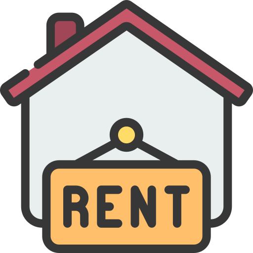

# HomeRental - Modern House Rental Platform (Frontend)



## Overview

HomeRental is a comprehensive house rental platform built with React that connects property owners with potential renters. The application features a modern, responsive UI with dark mode support, secure authentication, and a seamless rental request system.

## Features

### For Users

- **Browse Properties**: Search and filter available houses by location, price, amenities
- **Detailed Property Views**: View high-quality images, descriptions, amenities, and location information
- **Rental Requests**: Submit rental requests directly to property owners
- **User Profiles**: Manage personal information and track rental requests
- **Favorites**: Save and organize favorite properties
- **Dark/Light Mode**: Toggle between dark and light themes
- **Reviews**: Read and submit reviews for properties

### For Property Owners

- **Property Management**: Add, edit, and remove property listings
- **Request Management**: Review and respond to rental requests
- **Analytics**: Track property views and interest metrics

### For Administrators

- **User Management**: Manage user accounts and permissions
- **Content Moderation**: Review and moderate property listings
- **Category Management**: Create and manage property categories
- **Dashboard**: Access comprehensive analytics and platform statistics

## Getting Started

### Prerequisites

- Node.js (v14.0.0 or later)
- npm or yarn
- API Backend running (see backend repository)

### Installation

1. Clone the repository

   ```bash
   git clone https://github.com/yourusername/home-rental-frontend.git
   cd home-rental-frontend
   ```

2. Install dependencies

   ```bash
   npm install
   # or
   yarn install
   ```

3. Configure environment variables

   ```bash
   cp .env.example .env
   ```

   Then edit the `.env` file with your API endpoint and other configuration details.

4. Start the development server
   ```bash
   npm start
   # or
   yarn start
   ```

## Project Structure

```
src/
├── assets/         # Static assets like images and icons
├── components/     # Reusable UI components
├── config/         # Configuration files
├── context/        # React context providers
├── hooks/          # Custom React hooks
├── layouts/        # Page layout components
├── pages/          # Page components
├── services/       # API service functions
├── styles/         # Global styles and themes
├── utils/          # Utility functions
└── App.js          # Main application entry point
```

## Technologies Used

- **React**: Frontend library for building user interfaces
- **React Router**: For navigation between pages
- **Redux / Context API**: For state management
- **Axios**: For API communication
- **Styled Components / Tailwind CSS**: For styling components
- **React Query**: For efficient data fetching and caching
- **JWT Authentication**: For secure user authentication

## Development

### Code Style

We use ESLint and Prettier for code formatting. Run the linter with:

```bash
npm run lint
# or
yarn lint
```

### Building for Production

```bash
npm run build
# or
yarn build
```

This will create an optimized production build in the `build/` directory.

## API Integration

The frontend connects to a Django backend API. See the [backend repository](https://github.com/yourusername/home-rental-backend) for more details on API endpoints.

## Testing

Run tests with:

```bash
npm test
# or
yarn test
```

## Deployment

The application can be deployed to any static hosting service like Netlify, Vercel, or GitHub Pages.

```bash
npm run deploy
# or
yarn deploy
```

## Contributing

1. Fork the repository
2. Create your feature branch (`git checkout -b feature/amazing-feature`)
3. Commit your changes (`git commit -m 'Add some amazing feature'`)
4. Push to the branch (`git push origin feature/amazing-feature`)
5. Open a Pull Request

## License

This project is licensed under the MIT License - see the LICENSE file for details.

## Acknowledgments

- UI/UX inspired by modern design principles
- Icons from [FontAwesome](https://fontawesome.com/) and [Heroicons](https://heroicons.com/)
- Sample images from [Unsplash](https://unsplash.com/)
